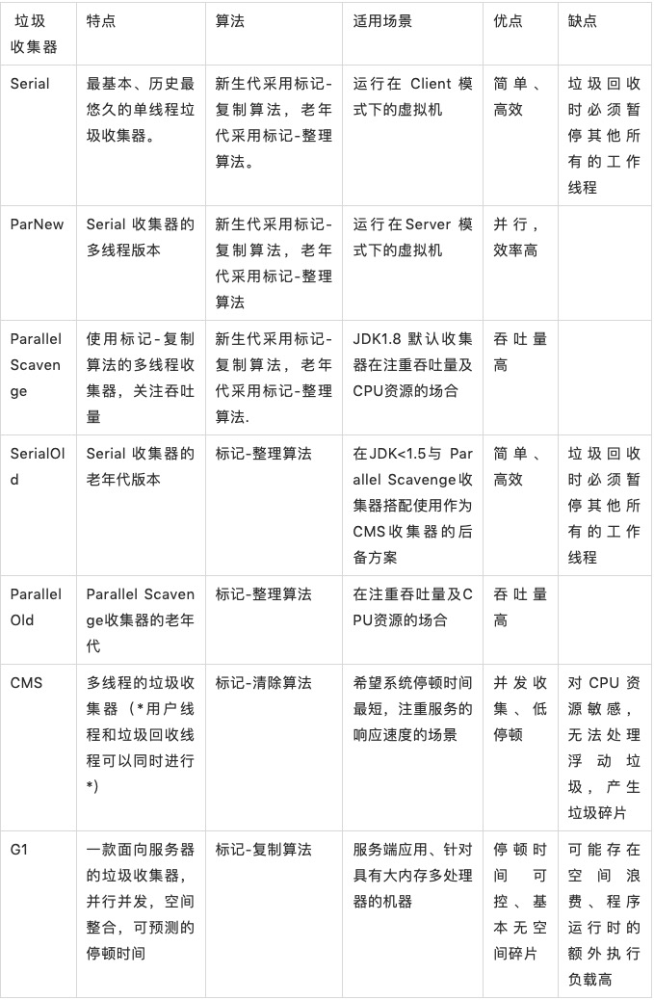
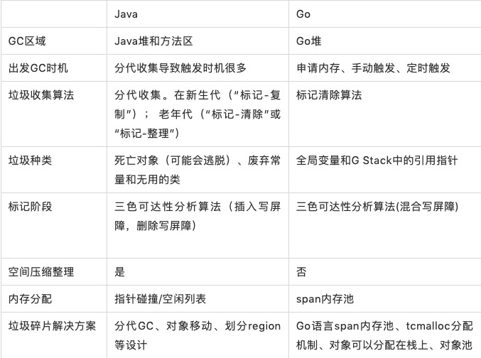
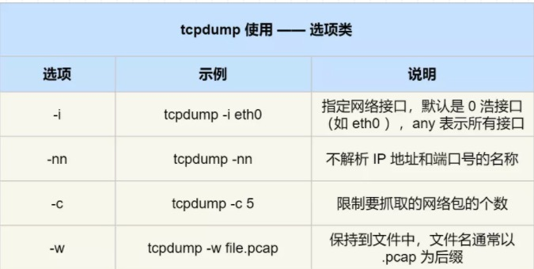
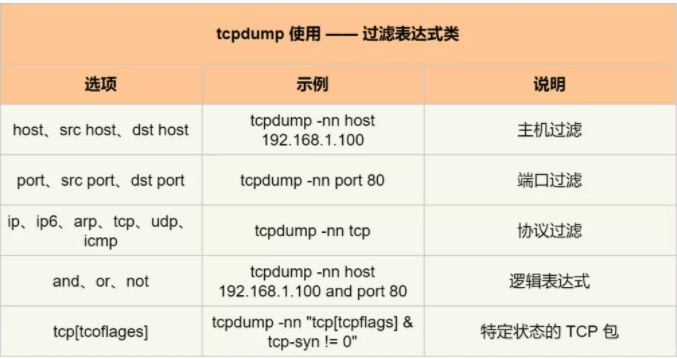
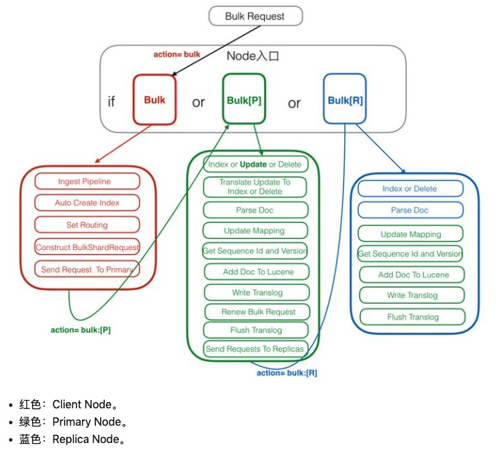
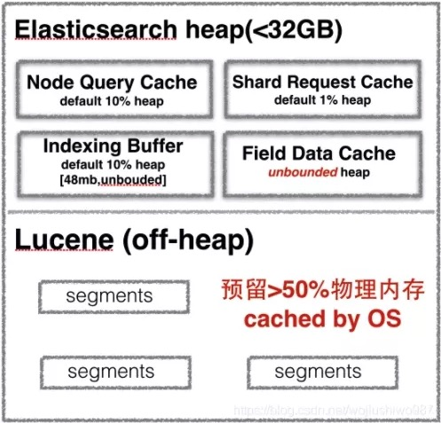

## 微信公众号高质量技术贴  
* 过滤掉对自己感觉没有技术相关性的，或者是那种水贴
* 对内容进行归类整理
* 阅读完写下自己的读后感
## LINUX

[从无盘启动看 Linux 启动原理](https://mp.weixin.qq.com/s/6vFXphhkPpyYEDSgibl_vA)  
1. "只读内存"(ROM)  ----"基本输入输出系统"(BIOS)  ----"硬件自检"(POST)  ----"启动顺序"(Boot Sequence)  
2. 上电自检----UEFI 固件被加载----加载 UEFI 应用----启动内核及 initramfs  
3. /sbin/init----/etc/inittab----etc/rcN.d  

[Linux 机器 CPU 毛刺问题排查](https://mp.weixin.qq.com/s/UFPi8PZ9GcAfaalCrWTmng)  
* Linux Agent 每分钟会采集 4 次 15 秒内的 CPU 平均使用率。为了避免漏采集 CPU 峰值，网管 Agent 取这一分钟内四次采集的最大值上报。  
* gcore {pid}的命令，可以保留堆栈信息，明确具体高负载的位置  
* spp 的cost_stat_tool工具/tcpdump抓包确认  

[Linux 入门必看：如何60秒内分析Linux性能](https://mp.weixin.qq.com/s/HvADkICPYflS2VTuSB16rg)  
**uptime**  系统启动时间  
**dmesg** | tail  系统的错误日志，eg：杀死 OOM 问题的进程，丢弃 TCP 请求的问题  
**vmstat 1**  查看CPU、内存、磁盘IO等待  
**mpstat -P ALL 1**  打印各个 CPU 的时间统计，eg：一个使用率明显较高的 CPU 就可以明显看出来这是一个单线程应用  
**pidstat 1**  pidstat 命令有点像 top 命令中的为每个 CPU 统计信息功能，但是它是以不断滚动更新的方式打印信息，而不是每次清屏打印  
**iostat -xz 1**  这个工具对于理解块设备（比如磁盘）很有用，展示了请求负载和性能数据  
**free -m**  显示了系统内存不足  
**sar -n DEV 1**  使用这个工具是可以检测网络接口的吞吐  
**sar -n TCP,ETCP**  每秒本地发起的 TCP 连接数；每秒远程发起的连接数；每秒 TCP 重传数（重传是网络或者服务器有问题的一个信号）    

[​Linux CPU 性能优化指南](https://mp.weixin.qq.com/s/7HGjAy_R_sdpfckFlFr0cw)  
工具帖  

[Linux I/O 原理和 Zero-copy 技术全面揭秘](https://mp.weixin.qq.com/s/dZNjq05q9jMFYhJrjae_LA)  
* 内核从本质上看是一种软件 —— 控制计算机的硬件资源，并提供上层应用程序 (进程)   运行的环境  
* 用户态即上层应用程序 (进程)   的运行空间，应用程序 (进程)   的执行必须依托于内核提供的资源，这其中包括但不限于 CPU 资源、存储资源、I/O 资源等等  
* 用户进程如何切换到内核态去使用那些内核资源呢？答案是：1)   系统调用（trap），2)   异常（exception）和 3)   中断（interrupt）  
* 利用 DMA 而非 CPU 来完成硬件接口和内核缓冲区之间的数据拷贝，从而解放 CPU，使之能去执行其他的任务，提升系统性能  
* 后面的就看不懂了  

[Linux 网络层收发包流程及 Netfilter 框架浅析](https://mp.weixin.qq.com/s/FbeSTXwMn4X83QdgvwW-pQ)  
**传输层**负责创建 sk_buff，并将用户数据（应用层数据）填充到缓冲区，做合法性检查后，添加传输层头部，并通过网络层注册的接口将数据包交给网络层处理  
**网络层**收到传输层数据包后，会查询路由表，决定数据包去向，如果是需要发出的数据包，会填充网络层头部，并交到内核虚拟网络接口设备的发送队列中  
**Linux 内核中**，Netfiler 在网络层设置了多个 Hook 点  

[如何写出让 CPU 跑得更快的代码？](https://mp.weixin.qq.com/s/XKYSk-5TO888LP3LIzxd_Q)  
进程可能在不同 CPU 核心来回切换执行，这对 CPU Cache 不是有利的，虽然 L3 Cache 是多核心之间共享的，但是 L1 和 L2 Cache 都是每个核心独有的，如果一个进程在不同核心来回切换，各个核心的缓存命中率就会受到影响  
在 Linux 上提供了 sched_setaffinity 方法，来实现将线程绑定到某个 CPU 核心这一功能  

[彻底搞懂 IO 底层原理](https://mp.weixin.qq.com/s/_Eh7eZLtcUjrp9QiCvLmrw)  
**BIO** 一个线程大约占用1M的空间;如果线程数量庞大，会造成线程做上下文切换的时间甚至大于线程执行的时间，CPU负载变高  
**NIO** 用户进程需要不断去主动询问内核数据准备好了没有;用户进程不断切换到内核态
IO多路复用  
**select()**  :复杂度O(n)  fd_set不可重用，fd_set有大小的限制，目前被硬编码成了1024；每次操作完都必须重置,数据取出后也需要轮询哪个fd上发生了变动
**poll()**  :通过event变量注册感兴趣的可读可写事件（POLLIN、POLLOUT），最后把 pollfd 交给内核。当有读写事件触发的时候，我们可以通过轮询 pollfd，判断revent确定该fd是否发生了可读可写事件  
**epoll()**  :O(1)  复杂度，返回的"nfds"是一个确定的可读写的数量，相比于之前循环n次来确认，复杂度降低了不少  

[深入理解计算机系统：进程](https://mp.weixin.qq.com/s/z6K8C56FnNVKu6XAQefViQ)  

[Linux 内核使用 Lockdep 工具来检测和特别是预测锁的死锁场景](https://mp.weixin.qq.com/s/NA-yPnHlNEKKem9PswGAWQ)  

## JVM GC JAVA
  

[为什么我们选择 Java 语言开发高频交易系统](https://mp.weixin.qq.com/s/YVv3wl9TVUhisq8gZXKscQ)  
* 高度定制的 Linux 内核，带有操作系统旁路，这样数据就可以直接从网卡 "跳转" 到应用程序、基于 IPC 进程间通信，甚至使用 FPGA  
* Zing虚拟机 解决了 GC 暂停和 JIT 编译问题  

[Java内存泄漏、性能优化、宕机死锁的N种姿势](https://mp.weixin.qq.com/s/ASrINfC8gHbYryIWSSwT_A)  
内存管理：  
0.堆内：老年代PS Old Generation使用率占99.99%，再结合gc log，如果老年代回收不掉，基本确认为堆上内存泄露；堆外：Java使用堆外内存导致的内存泄露、Java程序使用C++导致的内存泄露  
1.堆上内存泄漏：首先用jdk/bin/jmap -dump:live,format=b,file=heap.hprof {pid}，导出堆里所有活着的对象，然后用工具分析heap.hprof  
2.对象被静态对象引用：右键RaftServerMetrics->Merge shortest path to GC Roots ->with all references查找所有引用RaftServerMetrics的地方  
3.RPC连接使用完后未关闭：  
4.堆外内存泄露：首先开启-XX:NativeMemoryTracking=detail显示的内存不包含C++分配的内存（为了快速验证是否DirectByteBuffer导致内存泄露，可使用参数-XX:MaxDirectMemorySize限制ectByteBuffer分配的堆外内存大小，如果堆外内存仍然大于MaxDirectMemorySize，可基本排除DirectByteBuffer导致的内存泄露）  
5.Java调用C++组件：  
性能优化：  
1.arthas：开始perf: profiler start，采样一段时间后，停止perf: profiler stop。热点函数避免使用lambda表达式如stream.collect等  
2.jaeger：  
3.tcpdump：tcpdump -i eth0 -s 0 -A 'tcp dst port 9878 and tcp[((tcp[12:1] & 0xf0)   >2)  :4] = 0x47455420' -w read.cap，该命令在读200M文件时会将所有GET请求导出到read.cap件，然后用wireshark打开read.cap  
4.jstack：top -Hp pid命令打出进程pid的所有线程及每个线程的CPU消耗；然后计算出使用CPU最高的线程号的十六进制表示0x417，再用jstack -l pid jstack.txt命令打出所有线程状态  
宕机：  
1.被其他进程杀：排查工具有两个：linux自带的auditd和systemtap  
2.调用System的exit：可以用arthas排查：nohup ./as.sh -f system_exit.as 69001 -b system_exit.out 2>&1 &，即可监控进程69001调用  
3.Java调用的C++发生Crash：  
4.Java内Crash：-XX:ErrorFile -XX:+HeapDumpOnOutOfMemoryError -XX:HeapDumpPath  
死锁：  
1.jstack打出的死锁信息  

[Java中9种常见的CMS GC问题分析与解决](https://mp.weixin.qq.com/s/BoMAIurKtQ8Wy1Vf_KkyGw)  
**识别垃圾**: 引用计数法（Reference Counting）/可达性分析，又称引用链法（Tracing GC）  
**收集算法**: Mark-Sweep（标记 - 清除）存活对象较多时较高效/Mark-Compact （标记 - 整理）对存活对象按照整理顺序进行整理/Copying（复制）  
**收集器**: 分代收集器(ParNew/CMS)  、分区收集器（G1/ZGC/Shenandoah）  
**问题分类**: IO 交互型：互联网上目前大部分的服务都属于该类型大部分对象在 TP9999 的时间内都会死亡， Young 区越大越好 / MEM 计算型:  
**经验**：System.gc 的触发类型从 Foreground 改为 Background / 尽量将成对出现的空间大小配置参数设置成固定的/ Young/Eden 区过小，我们可以在总的 Heap 内存不变的情况下适当增大 Young 区，具体怎么增加？一般情况下 Old 的大小应当为活跃对象的 2~3 倍左右  
**Dump Diff 和 Leak Suspects 比较直观**: 同时分别在 CMS GC 的发生前后分别 dump 一次来分析内存泄漏  
CMS GC 退化后，影响会非常大，建议发现一次后就彻底根治。只要能定位到内存碎片、浮动垃圾、增量收集相关等具体产生原因  
**堆外内存泄漏**: 使用 NMT（NativeMemoryTracking） 进行分析 / Google perftools + Btrace 等工具  

[java线程池（newFixedThreadPool）线程消失疑问？](https://www.zhihu.com/question/27474985)  
线程池的异常线程会被销毁，然后重新创建新的线程来补位  

[字节码增强：原理与实战](https://mp.weixin.qq.com/s/vTfnj8SXUx4_0Ayar2NPPw)  
* 不同需求场景下，可以不同的方式实现切面拦截逻辑；  
* AspectJ或者SpringAop只是一种对开发者友好的快捷方式，本质上还是修改的业务代码，只不过隐藏了调用逻辑，并不能真正“无侵入“；  
* javaagent可以无侵入的修改一个已发布的java组件的运行逻辑。  
* 修改某些字节或者替换整个二进制流可以修改运行时逻辑,工具集：/ASM/javaassist/ByteBuddy  
* VMTI 提供了许多事件（Event）的回调，包括虚拟机初始化、开始运行、结束，类的加载，方法出入，线程始末等等  

[Java ConcurrentHashMap 高并发安全实现原理解析](https://mp.weixin.qq.com/s/4sz6sTPvBigR_1g8piFxug)  
这个vivo是下了功夫了

[java.util.ConcurrentModificationException详解](https://www.jianshu.com/p/c5b52927a61a)  
1.迭代ArrayList的Iterator中有一个变量expectedModCount  
2.该变量会初始化和modCount相等，但如果接下来如果集合进行修改modCount改变，就会造成expectedModCount!=modCount  
3.Iterator的remove会修改expectedModCount，对单线程有用多线程无用  

[Java并发编程：并发容器之CopyOnWriteArrayList](http://www.cnblogs.com/dolphin0520/p/3938914.html)  
CopyOnWrite容器也是一种读写分离的思想，读和写不同的容器  
写操作复制出一个新的容器，然后新的容器里添加元素（加锁），读还是会读到旧的数据（不加锁）  

[深入分析ConcurrentHashMap](http://ifeve.com/concurrenthashmap/)  
**get方法**里将要使用的共享变量都定义成volatile，java内存模型的happen before原则，对volatile字段的写入操作先于读操作  
**put方法**里需要对共享变量进行写入操作，所以为了线程安全，在操作共享变量时必须得加锁  
**count方法**先尝试两次不行再加锁，modCount变量，在put, remove和clean方法里操作元素前都会将变量modCount进行加1  
那么在统计size前后比较modCount是否发生变化，从而得知容器的大小是否发生变化  

[Java 语言中锁的设计与应用](https://mp.weixin.qq.com/s/cGJxllpHskK4castfOJ_gw)  
**无锁(01)**: CAS 原理及应用即是无锁的实现。无锁无法全面代替有锁，但无锁在某些场合下的性能是非常高的。  
**偏向锁(01)**: 在 Mark Word 里存储锁偏向的线程 ID。在线程进入和退出同步块时不再通过 CAS 操作来加锁和解锁，而是检测 Mark Word 里是否存储着指向当前线程的偏向锁。  
**轻量级锁(00)**: 指当锁是偏向锁的时候，被另外的线程所访问，偏向锁就会升级为轻量级锁，其他线程会通过自旋的形式尝试获取锁，不会阻塞，从而提高性能。  
**重量级锁(10)**: 若当前只有一个等待线程，则该线程通过自旋进行等待。但是当自旋超过一定的次数，或者一个线程在持有锁，一个在自旋，又有第三个来访时，轻量级锁升级为重量级锁。  
**公平锁 VS 非公平锁(ReentrantLock)**: 源码区别hasQueuedPredecessors()  :主要是判断当前线程是否位于同步队列中的第一个。如果是则返回 true，否则返回 false。  
**可重入锁 VS 非可重入锁(NonReentrantLock)**: 其父类 AQS 中维护了一个同步状态 status 来计数重入次数，status 初始值为 0。  
**独享锁 VS 共享锁(ReentrantReadWriteLock)**: 将 state 变量 “按位切割” 切分成了两个部分，高 16 位表示读锁状态（读锁个数），低 16 位表示写锁状态（写锁个数）。  

[自动的内存管理系统实操手册——Java垃圾回收篇](https://mp.weixin.qq.com/s/KqsFuvTo_M5w7xoYe0gGrw)  
Java 堆和方法区是垃圾收集器管理的主要区域  
**对象晋升到老年代的年龄阈值**，可以通过参数-XX:MaxTenuringThreshold来设置  
**当对象没有覆盖finalize方法**，或 finalize 方法已经被虚拟机调用过时，虚拟机将这两种情况视为没有必要执行第一次标记  
**标记清除算法（适合old）**: 1.空间问题，易产生内存碎片；2.效率问题，扫描了整个空间两次  
**标记复制算法（适合young）**: 需要一块儿空的内存空间，整理阶段，由于移动了可用对象，需要去更新引用。  
**标记整理算法 (适合old）**: 在清理时，是先把所有存活对象往一端移动，然后直接清掉边界以外的内存。  

[自动的内存管理系统实操手册——Golang垃圾回收篇](https://mp.weixin.qq.com/s/yEPCSzBvp1SqkyOcx2r1jQ)  

[自动的内存管理系统实操手册——Java和Golang对比篇](https://mp.weixin.qq.com/s/1DZ8ENjsxrKypjr2RGhruQ)  
**触发垃圾回收的时机**：Java当应用程序空闲时，Java堆内存不足时，GC会被调用；Go runtime.mallocgc申请内存时根据堆大小触发GC，runtime.GC用户程序手动触发GC，runtime.forcegchelper后台运行定时检查触发GC  
**收集算法**：当前Java虚拟机的垃圾收集采用分代收集算法，当前Go的都是基于标记清除算法进行垃圾回收  
**垃圾碎片处理**：JVM在处理内存碎片问题上更多采用空间压缩和分代收集的思想；Go语言span内存池的设计，减轻了很多内存碎片的问题  
**“GC Roots” 的对象选择**：Go的选择就相对简单一点，即全局变量和G Stack中的引用指针，简单来说就是全局量和go程中的引用指针。  
**写屏障**：CMS是基于“Dijkstra插入写屏障”做并发标记的，G1、Shenandoah则是使用“Yuasa删除写屏障”来实现的；  
  

[上篇 | 说说无锁(Lock-Free)  编程那些事](https://mp.weixin.qq.com/s/T_z2_gsYfs6A-XjVTVV_uQ)  

[下篇 | 说说无锁(Lock-Free)  编程那些事（下）](https://mp.weixin.qq.com/s/h75n7sHnrmoLJ4DVAW5AUQ)  

[Oracle JDK7 bug 发现、分析与解决实战](https://mp.weixin.qq.com/s/8f34CaTp--Wz5pTHKA0Xeg)  
JDK 并没有关闭 ImageIO.read(url)   代码中封装的 Socket 连接！CDN 会请求超时关闭导致服务器处于 CLOSE_WAIT？限于网络经验有限，并不能 100% 确认我的想法。模拟复现  

## OKHttp Protobuf GRPC TOMCAT

[OkHttp3线程池相关之Dispatcher中的ExecutorService](https://github.com/soulrelay/InterviewMemoirs/issues/7)  
* OkHttp不是在线程池中维护线程的个数，线程是一直在Dispatcher中直接控制。  
* 线程池中的请求都是运行中的请求。这也就是说线程的重用不是线程池控制的，通过源码我们发现线程重用的地方是请求结束的地方finished(AsyncCall call)   ，而真正的控制是通过promoteCalls方法， 根据maxRequests和maxRequestsPerHost来调整runningAsyncCalls和readyAsyncCalls，使运行中的异步请求不超过两种最大值，并且如果队列有空闲，将就绪状态的请求归类为运行中  

[奇怪的知识： okhttp 是如何支持 Http2 的？](https://mp.weixin.qq.com/s/TeQhe4T4wRjdAEPz6Ne45g)  
在一个 TCP 连接上，我们可以向对方不断发送帧，每帧的 stream identifier 的标明这一帧属于哪个流，然后在对方接收时，根据 stream identifier 拼接每个流的所有帧组成一整块数据。  

* Grpc协议
**gRPC 协议**，简单来说就是 http2 协议的基础之上，增加了特定的协议 header：“grpc-” 开头的 header 字段，采用特定的打解包工具（protobuf）对数据进行序列化，从而实现 RPC 调用。  
**在 gRPC 的 stream 调用中**，可在 server 端回传的过程中发送多次 Data，调用结束后再发送 Header 终止 RPC 过程，并汇报状态信息。  

[gRPC客户端详解](http://liumenghan.github.io/2019/10/07/grpc-in-depth/)  
* Thrift的客户端是线程不安全的——这意味着在Spring中无法以单例形式注入到Bean中  
* gRPC服务端的Response都是异步形式  
* gRPC的客户端有同步阻塞客户端（blockingStub)  和异步非阻塞客户端(Stub）两种  

[grpc原理](https://www.jianshu.com/p/9e57da13b737)  

[gRPC 基础概念详解](https://mp.weixin.qq.com/s/I2QHEBO26nGqhGwIw281Pg)  
无论是 Client 还是 Server，在以异步方式进行处理时，都要预先分配好一定的内存 / 对象，以存储异步的请求或返回。  
其实，回调方式的异步调用属于实验性质的，不建议直接在生产环境使用，这里也只做简单的介绍：  
**Notice**: This API is EXPERIMENTAL and may be changed or removed at any time.  
**Client 发送流**，是通过 Writer->WritesDone()   函数结束流  
**Server 发送流**，是通过结束 RPC 函数并返回状态码的方式来结束流  
流接受者，都是通过 Reader->Read()   返回的 bool 型状态，来判断流是否结束  
Server 并没有像 Client 一样调用 WriteDone()  ，而是在消息之后，将 status code、可选的 status message、可选的 trailing metadata 追加进行发送，这就意味着流结束了  
End-Of-Stream 并没有单独的数据去描述，而是通过 HTTP2 的数据帧上带一个 END_STREAM 的 flag 来标识的  

[深入了解 gRPC：协议](https://mp.weixin.qq.com/s/GEaTUTp_wuILYTVbZvJo7g)  

[使用Wireshark分析gRPC消息](https://mp.weixin.qq.com/s/7yONCsXhKw1TOIGqf4Eo9g)  
在preferences > Protocols > Protobuf下Edit辑菜单中设置Protobuf的搜索路径，从而告诉Wireshark在哪里可以找到.proto文件。  

[程序员如何用gRPC谈一场恋爱](https://mp.weixin.qq.com/s/Y2sHs_Sq4lB3hBhKGSvaNg)  
**A client-to-server streaming RPC** :1.agent上报CPU，内存等数据到server;2.客户端心跳;3.客户端并发调用细小粒度的接口。  
**A server-to-client streaming RPC** :1.股票app。客户端向服务端发送一个股票代码，服务端就把该股票的实时数据源源不断的返回给客户端;2.app的在线push。  
**A Bidirectional streaming RPC** 1.聊天机器人;2.有状态的游戏服务器进行数据交换。  

[巧用 Protobuf 反射来优化代码，拒做 PB Boy](https://mp.weixin.qq.com/s/ALhSKrLwNdA_GkozJQXn5g)  
* 获取 PB 中所有非空字段：bool has_field = reflection->HasField(message, field)  
* 将字段校验规则放置在 Proto 中：optional string name   =1 [(field_rule)  .length_min = 5, (field_rule)  .id = 1]  
* 基于 PB 反射的前端页面自动生成方案  
* 通用存储系统(根据反射取出K/V)  

[一文讲懂进程间通信的几种方式](https://mp.weixin.qq.com/s/TZJ0N8iDjU3dEoU6W1GctQ)  

[Tomcat 优雅关闭之路](https://mp.weixin.qq.com/s/ZqkmoAR4JEYr0x0Suoq7QQ)  

[Tomcat 9.0.26 高并发场景下DeadLock问题排查与修复](https://mp.weixin.qq.com/s/GvFeFXsINaQjymnbXkOovw)  

[Tomcat 应用中并行流带来的类加载问题](https://mp.weixin.qq.com/s/f-X3n9cvDyU5f5NYH6mhxQ)  

## Hystrix Seata Sentinel

[分钟简述熔断器使用方法](https://mp.weixin.qq.com/s/KelqbAbRCUQdW3H8NjnooA)  

[Sentinel 是如何做限流的](https://mp.weixin.qq.com/s/s2h4dzFHse6LW0l0gudp9A)  

[Seata是什么？一文了解其实现原理](https://mp.weixin.qq.com/s/w-Tq6HFx5PqXpAPFDO_huA)  

[Canal 组件简介与 vivo 帐号实践](https://mp.weixin.qq.com/s/X1OFhjpHZSuIMr5PmxXBRQ)  

[Hystrix 如何解决 ThreadLocal 信息丢失](https://mp.weixin.qq.com/s/nmHcf7yQJIHXBf6W4KtF8w)  

[分布式事务：Saga模式](https://www.jianshu.com/p/e4b662407c66)  

## logging tracing metrics

[vivo 调用链 Agent 原理及实践](https://mp.weixin.qq.com/s/vPgBLi-2svhU_t1wN-6ZBA)  


[构建 Netflix 分布式追踪（tracing）体系](https://mp.weixin.qq.com/s/NmGYfoJ7pw8CfRfUkc6o2Q)  

[报警的哲学](https://mp.weixin.qq.com/s/lJRPt7I0SeUwZ4HhVZn8AQ)  

[基于Prometheus来做微服务监控，有多吃香？](https://mp.weixin.qq.com/s/2xsF_JqGJCIz5i6CZ_ckxg)  

[Prometheus远程写入InfluxDB，遇到OOM引发的错误怎么解？](https://mp.weixin.qq.com/s/SvWg2XpdpSlFKbwGayJV2w)  

[深入浅出开源监控系统Prometheus（上）](https://mp.weixin.qq.com/s/4NC4spF6cEvXuIBKVbIU7A)  

[OpenTSDB 数据存储详解](https://mp.weixin.qq.com/s/qayKiwk5QAIWI7-nyD3FVA)  

[美图全链路监控实战，成本低还能直接落地](https://mp.weixin.qq.com/s/fVZ_xlQ9UeflNYsdMjG0cw)  

## CI CD UnitTest

[如何有效地进行代码 Review？](https://mp.weixin.qq.com/s/uFivYfX53s5zAe6hacznlg)  

[这才是真正的Git——Git实用技巧](https://mp.weixin.qq.com/s/qNqZvjy0RXC0MA5WdSUhAA)  

[万字详文告诉你如何做 Code Review](https://mp.weixin.qq.com/s/c3RApB8a98tWahgC9mahJg)  

[如何有效地进行代码 Review？](https://mp.weixin.qq.com/s/uFivYfX53s5zAe6hacznlg)  

## TCP HTTP STOCKET

[爱奇艺网络协程编写高并发应用实践](https://mp.weixin.qq.com/s/XAEzZAUYuOhuqMOszNFe2A)  

[彻底弄懂TCP协议：从三次握手说起](https://mp.weixin.qq.com/s/6LiZGMt2KRiIoMaLwx-lkQ)  

[​TCP 拥塞控制详解](https://mp.weixin.qq.com/s/KTKVu3uCC5MFlU5oylZPFA)  

[一个有关tcp的非常有意思的问题](https://mp.weixin.qq.com/s/7TbCIu3MtL4BNo06Ad8cDA)  
客户端在第一次write之前，服务端的socket收到fin包，进入到CLOSE_WAIT状态  
此时，其实并不能说明服务端已经完全关闭了连接，它还有可能是发送fin包，只是为了关闭其send端，但它还是可以读的，所以客户端理应也可以继续写。  

[【TCP】CONNECTION RESET BY PEER 原因分析定位](https://www.freesion.com/article/1316615554/)  
1.客户端recev-Q阻塞，表明客户端处理不过来，操作系统接收缓冲区阻塞，程序没有及时消费掉  
2.nginx服务端send-Q阻塞，不能及时发出去，表明下游程序收不过来，和上述客户端现象表现一致；  
3.查看客户端处理代码逻辑，发现单线程处理，效率低下，改成异步线程池提交处理的方式，问题解决。  
4.linux操作系统的三个参数，跟此次现象有关：net.ipv4.tcp_keepalive_time;net.ipv4.tcp_keepalive_intvl;net.ipv4.tcp_keepalive_probes

[JAVA.IO.IOEXCEPTION: CONNECTION RESET BY PEER问题解决](https://www.freesion.com/article/3680678097/)  
1.当并发请求超过服务器的承载量时，服务器会停掉一些请求   
2.客户端关闭了  
3.防火墙/nginx影响了,1>高并发的处理;2>防DDOS攻击;3>爬虫扫描等等  

[https连接的前几毫秒发生了什么](https://www.rrfed.com/2017/02/03/https/)  
1.https解决什么问题:1.域名污染/2.APR欺骗  
2.https是应对中间人攻击的唯一方式  
3.RSA加密和解密,密钥交换Key Exchange(证书被偷也没事)  
4.怎样绕过https：使用ssltrip，这个工具它的实现原理是先使用arp欺骗和用户建立连接，然后强制将用户访问的https替换成http。即中间人和用户之间是http，而和服务器还是用的https  

[一文读懂 HTTP/1HTTP/2HTTP/3](https://mp.weixin.qq.com/s/fy84edOix5tGgcvdFkJi2w)  

[白话http2的多路复用](https://mp.weixin.qq.com/s/-mg4AD4-ea_W3aUFchSQIQ)  

[移动端APM网络监控与优化方案](https://mp.weixin.qq.com/s/MnlxrUwB57lqE1aExr0iGA)  
网络状况较好时，HTTP2.0多路复用，带来了性能上的优势，但在网络不稳定时，HTTP1.1错误率低于HTTP2.0。
1.多域名连接共享，实现0RTT多路复用  
2.避免了DNS解析，防止DNS劫持
3.protobuf编码私有协议，节省流量

[深入理解web协议(二)  ：DNS、WebSocket](https://mp.weixin.qq.com/s/AkbAN4UZLDf841g1ZLFPBQ)  

[深入理解 web 协议(一)  - http 包体传输](https://mp.weixin.qq.com/s/WlT8070LlrnSODFRDwZsUQ)  

[一文搞定 Wireshark 网络数据包分析](https://mp.weixin.qq.com/s/hL96imOvuodILIhI70fbTg)  
调整数据包列表中时间戳显示格式:View -->Time Display Format --> Date and Time of Day。
  
  

## REDIS ES MYSQL MongoDB

[Redis 进阶笔记](https://mp.weixin.qq.com/s/o66KCbJUj4RsgXFjXzLzoQ)  
1.Redis 里的 List 设计非常牛，当数据量比较小的时候，数据结构是压缩链表，而当数据量比较多的时候就成为了快速链表。  
2.hash 的扩容 rehash 过程就是维护了两个 hash 结构，如果需要扩容的时候，就把新的数据写入新字典中，然后后端起一个线程来逐步迁移，总体上来说就是采用了空间换时间的思想。  
3.对于上游的客户端请求，采用了多路复用的原理。Redis 会给每一个客户端套接字都关联一个指令队列，客户端的指令队列通过队列排队来进行顺序处理，同时 Reids 给每一个客户端的套件字关联一个响应队列，Redis 服务器通过响应队列来将指令的接口返回给客户端  
在 Redis 4.0 之后，支持了混合持久化 RDB + 增量的 AOF 文件  

[这篇Redis文章，Antirez看了都说好](https://mp.weixin.qq.com/s/DCngASQ7gsKpFA2JHCH7Sg)  
mem_fragmentation_ratio一般大于1，且该值越大，内存碎片比例越大。如果mem_fragmentation_ratio<1，说明Redis使用了虚拟内存，由于虚拟内存的媒介是磁盘，比内存速度要慢很多，当这种情况出现时，应该及时排查，如果内存不足应该及时处理  

[聊一聊Redis持久化开与关](https://mp.weixin.qq.com/s/TZnDk_5qScLFPGPhwrxTQA)  
**RDB备份**格式多变（Redis 3 4 5 6版本多次修改）  
**AOF备份**加载慢：利用fakeclient做回放，AOF重写还是动作不，开启AOF后，Redis的写性能下降了8~25%，读性能未下降  
**RDB-AOF混合**持久化文件全量使用RDB，增量使用AOF，保证体积、实时性、加载速度。  

[Redis小功能大用处(1)  -stat_expired_time_cap_reached_count](https://mp.weixin.qq.com/s/3UxXnSus0HTlA0ndpLZPgg)  

[Redis常见客户端异常汇总(Jedis篇)  ](https://mp.weixin.qq.com/s/T-BBlAQ4B5qj0VCTKUMgXA)  

[Redis在Linux系统的配置优化](https://mp.weixin.qq.com/s/eN8qQn9HjeI1BV-MMFcWiw)  

[Redis module功能介绍](https://mp.weixin.qq.com/s/uN1Iyha96TCG7Ff2ZRW1Dw)  

[Redis 6.2 RC发布新特性一览](https://mp.weixin.qq.com/s/dwUze7I2zoryNmTHmrG5PQ)  

[败家玩意儿！Redis 竟然浪费了这么多内存！](https://mp.weixin.qq.com/s/efPjJjdDHW6QOhSfHOioRA)  

[从1到3分布式Redis电商实战&缓存穿透&缓存雪崩&缓存失效终极解决](https://www.bilibili.com/video/BV17T4y1F79p?p=1&share_medium=android&share_plat=android&share_source=COPY&share_tag=s_i&timestamp=1607301887&unique_k=sVref8)  

[替你踩过Redis缓存的坑，奉上使用规范和监控方法](https://mp.weixin.qq.com/s/R-slZDV2YNTA_M_sctyvZA)  

[Redis为什么变慢了？Redis性能问题排查详述](https://mp.weixin.qq.com/s/gYQn9tdFK9tHJDoMWcU4cQ)  
超级实用，建议看原文  

[运维：终于不用再背着数万实例的Redis集群了](https://mp.weixin.qq.com/s/F5Wn6OWKzswA4tg2fHrevw)  

[一万字详解 Redis Cluster Gossip 协议](https://segmentfault.com/a/1190000038400015)  

[Codis VS Redis Cluster：我该选择哪一个集群方案](https://time.geekbang.org/column/article/85495ce4171a7dc638c424414e229cac/share)  
codis提供了  
1.dashboard的fe界面运维简单  
2.基于zookeeper的proxy代理slot-mapping映射  
3.基于sentinel的主从切换高可用  
codis提供了异步的数据迁移方案（其中对大key拆分迁移的原子性方案），对比redis-cluster来说相对应用较早  

[Redis 缓存性能实践及总结](https://mp.weixin.qq.com/s/bsAw0VKhP_SYngvKMoByAQ)  

[Redis小功能大用处-total_net_output_bytes](https://mp.weixin.qq.com/s/emr4_clKV4qW0gmtHiINiQ)  

[Redis速度快的原因：几点图解总结](https://mp.weixin.qq.com/s/FtfAqXXDef6-bhuGyPDK7w)  

[深入浅出百亿请求高可用Redis(codis)  分布式集群揭秘](https://mp.weixin.qq.com/s/F68-e2umTQIq0aGfif58ow)  

[干货 | 数万实例数百TB数据量，携程Redis治理演进之路](https://mp.weixin.qq.com/s/L7EQzthCoWuJw8TzY-KAMw)  

[干货 | 携程Redis治理演进之路（二）](https://mp.weixin.qq.com/s/QTqcBZlAhp5cLRJGJVZRNw)  

[pika集群水平扩展——让性能容量不再受限](https://mp.weixin.qq.com/s/xksAosZSpLVjb1JuX5XhRQ)  

[Spark-Redis入门到解决执行海量数据插入、查询作业时碰到的问题](https://mp.weixin.qq.com/s/K84I-mUf7U9Iej6h3un-bQ)  

[超全的数据库建表/SQL/索引规范，适合贴在工位上！](https://mp.weixin.qq.com/s/-_m-OJ_PUXrw8Gey2ZA9aA)  

[MySQL 5.6.35 索引优化导致的死锁案例解析](https://mp.weixin.qq.com/s/T5e-gb0MXxjBwbjGg6jIMg)  
原因是:index_merge是MySQL 5.1后引入的一项索引合并优化技术，它允许对同一个表同时使用多个索引进行查询，并对多个索引的查询结果进行合并(取交集(intersect)  、并集(union)  等)  后返回。  
死锁的本质原因还是由加锁顺序不同所导致，是由于Index Merge同时使用2个索引方向加锁所导致，解决方法也比较简单，就是消除因index merge带来的多个索引同时执行的情况。  

[让MySQL飞起来！别小看这21种写SQL的好习惯](https://mp.weixin.qq.com/s/snV9i2qUR1yUje80YzxwOg)  
* 操作delete或者update语句，加个limit  
* SQL命令行修改数据，养成begin + commit 事务的习惯  
* 写完SQL先explain查看执行计划  
* 如果修改/更新数据过多，考虑批量进行  

[我在MySQL原厂的那些年都经历了什么？](https://mp.weixin.qq.com/s/HW7tji_fQBeOa7kr2xsmtg)  

[高并发场景下，百万级订单量系统的分库分表重构经历](https://mp.weixin.qq.com/s/Mp6yyS3VVj2v1D1gxuojwA)  

[3年部署3000套PG实例的架构设计与踩坑经验](https://mp.weixin.qq.com/s/OPQr248yiwFI9Q6vLx9tZw)  

[简述3种CQRS架构模式](https://mp.weixin.qq.com/s/pToMvg5tNJKfRmJdNfXicw)  

[InnoDB 事务加锁分析](https://mp.weixin.qq.com/s/S7MhlsZveBHRSQhq5aTIJA)  

[MySQL 的 crash-safe 原理解析](https://mp.weixin.qq.com/s/5i9wmJs4_Er7RaYfNnETyA)  

[MySQL 8 新特性之Clone Plugin](https://mp.weixin.qq.com/s/_HqRXhQX_6e0boACzcAH8g)  

[MySQL 索引知识点总结](https://mp.weixin.qq.com/s/QduIxKOykMmoZp13UGF1XQ)  

[API 分页设计与实现](https://mp.weixin.qq.com/s/TQ248e9171jOHSYxdgLBWA)  
在数据库中有一个游标（cursor）的概念，它是一个指向行的指针，然后可以告诉数据库："在这个游标之后返回 100 行"。  
使用游标的另一个原因是避免由于并发编辑而导致元素重复或跳过的问题,而不用担心新的记录进来扰乱你的分页。  

[一次看完28个关于ES的性能调优技巧](https://mp.weixin.qq.com/s/nnOazH26pq-Kn8zlGKgvTA)  

[ElasticSearch使用规范beta版](https://mp.weixin.qq.com/s/yCTNH1hMp6iOvHgh9vWg6A)  
* 非日志型(搜索型、线上业务型)  的shard容量在10~30GB（建议在10G）  
* 日志型的shard容量在30~100GB（建议30G）  
* 单个shard的文档个数不能超过21亿左右(Integer.MAX_VALUE - 128)  
* 一个节点管理的shard数不要超过200个  
* routing id不均衡：集群容量和访问不均衡，对于分布式存储是致命的  
* 拒绝大聚合 ：ES计算都在JVM内存中完成  
* 拒绝模糊查询：es一大杀手  
* 拒绝深度分页  
* 禁止查询 indexName-*  

[Elasticsearch分布式一致性原理剖析(一)-节点篇](https://zhuanlan.zhihu.com/p/34830403)  
1 扩容DataNode  
2 缩容DataNode 我们需要把这个Node上的Shards迁移到其他节点上，方法是先设置allocation规则，禁止分配Shard到要缩容的机器上，然后让集群进行rebalance。  
3 扩容MasterNode 假设之前3个master-eligible node，我们可以配置quorum为2，如果扩容到4个master-eligible node，那么quorum就要提高到3。  
4 缩容MasterNode  
ES的leader选举：  
**是否有选举周期term**：raft引入了选举周期的概念，每轮选举term加1，保证了在同一个term下每个参与人只能投1票。ES在选举时没有term的概念，不能保证每轮每个节点只投一票。  
**选举的倾向性**：raft中只要一个节点拥有最新的已提交的数据，则有机会选举成为master。在ES中，version相同时会按照NodeId排序，总是NodeId小的人优先级高。 

[Elasticsearch分布式一致性原理剖析(二)-Meta篇](https://zhuanlan.zhihu.com/p/35283785)  
MetaData是由Master管理的，为什么DataNode上也要保存MetaData呢？主要原因是考虑到数据的安全性，很多用户没有考虑Master节点的高可用和数据高可靠，在部署ES集群时只配置了一个MasterNode，如果这个节点不可用，就会出现Meta丢失，后果非常严重。  

[Elasticsearch分布式一致性原理剖析(三)-Data篇](https://zhuanlan.zhihu.com/p/35285514)  
* ES写入流程为先写入Primary，再并发写入Replica，最后应答客户端  
**waitforactiveshards** 这个参数默认是1，即只要Primary在就可以写入，起不到什么作用。如果配置大于1，可以起到一种保护的作用，保证写入的数据具有更高的可靠性。  
**为何要等待所有Replica响应(或连接失败)后返回?**  
在更早的ES版本，Primary和Replica之间是允许异步复制的，即写入Primary成功即可返回。  
如果Replica写入失败，ES会执行一些重试逻辑等，但最终并不强求一定要在多少个节点写入成功。在返回的结果中，会包含数据在多少个shard中写入成功了，多少个失败了  
**如果某个Replica持续写失败，用户是否会经常查到旧数据？**  
如果一个Replica写失败了，Primary会将这个信息报告给Master，然后Master会在Meta中更新这个Index的InSyncAllocations配置，将这个Replica从中移除，移除后它就不再承担读请求。  
**为什么要写translog？**  
1. translog类似于数据库中的commitlog，或者binlog。只要translog写入成功并flush，那么这笔数据就落盘了，数据安全性有了保证，Segment就可以晚一点落盘。  
2. translog记录了每一笔数据更改，以及数据更改的顺序，所以translog也可以用于数据恢复。  
3. 用于Primary和新的Replica之间的数据同步，即Replica逐步追上Primary数据的过程。  
**PacificA算法** 是微软亚洲研究院提出的一种用于日志复制系统的分布式一致性算法  
Reconfiguration：Secondary故障，Primary故障，新加节点  
SequenceNumber、Checkpoint与故障恢复  
LocalCheckpoint和GlobalCheckpoint  

[Elasticsearch内核解析 - 写入篇](https://zhuanlan.zhihu.com/p/34669354)  
* ES的写操作是primary写入完成之后，同时给replica
源码位置：org.elasticsearch.action.support.replication.ReplicationOperation#execute
写入操作的延时 latency = Latency(Primary Write) + Max(Replicas Write)  
  
**可靠性**：由于Lucene的设计中不考虑可靠性，在Elasticsearch中通过Replica和TransLog两套机制保证数据的可靠性。  
**原子性**：Add和Delete都是直接调用Lucene的接口，是原子的。当部分更新时，使用`Version`和锁保证更新是原子的  
**性能**  
一是不需要所有Replica都返回后才能返回给用户，只需要返回特定数目的就行；  
二是生成的Segment现在内存中提供服务，等一段时间后才刷新到磁盘，Segment在内存这段时间的可靠性由TransLog保证；  
三是TransLog可以配置为周期性的Flush，但这个会给可靠性带来伤害；  
四是每个线程持有一个Segment，多线程时相互不影响，相互独立，性能更好；  
五是系统的写入流程对版本依赖较重，读取频率较高，因此采用了versionMap，减少热点数据的多次磁盘IO开销。  

[Elasticsearch调优实践](https://mp.weixin.qq.com/s/0TMESj2Z-XK2PzwBQo0Mpg)  
```
一 Linux参数调优
mount -o noatime,data=writeback,barrier=0,nobh /dev/sda /es_data

二 ES 节点配置
1. 适当增大写入 buffer 和 bulk 队列长度，提高写入性能和稳定性
2. 计算 disk 使用量时，不考虑正在搬迁的 shard
cluster.routing.allocation.disk.include_relocations: false

三 ES 使用方式
1. 控制字段的存储选项 
    StoreFiled： 行存，其中占比最大的是 source 字段，它控制 doc 原始数据的存储。
    注意：关闭 source 后， update, updatebyquery, reindex 等接口将无法正常使用，所以有 update 等需求的 index 不能关闭 source。
    docvalues：控制列存. ES 主要使用列存来支持 sorting, aggregations 和 scripts 功能，对于没有上述需求的字段，可以关闭 docvalues，降低存储成本。
    index：控制倒排索引。ES 默认对于所有字段都开启了倒排索引，用于查询。对于没有查询需求的字段，可以关闭倒排索引。
    all(6.0+版本已删除)：ES 的一个特殊的字段，ES 把用户写入 json 的所有字段值拼接成一个字符串后，做分词，然后保存倒排索引，用于支持整个 json 的全文检索。
    fieldnames：该字段用于 exists 查询，来确认某个 doc 里面有无一个字段存在。若没有这种需求，可以将其关闭。
2. 开启最佳压缩
3. bulk 批量写入
    每个 bulk 请求的 doc 数量设定区间推荐为 1k~1w
4. 调整 translog 同步策略
    "sync_interval": "60s"
    "durability": "async"
5. 调整 refresh_interval
    ES 必须通过 refresh 的过程把内存中的数据转换成 Lucene 的完整 segment 后，才可以被搜索。
6. merge 并发控制
    "index.merge.scheduler.max_thread_count": 2
7. 写入数据不指定_id，让 ES 自动产生
    无 id 的数据写入性能可能比有_id 的高出近一倍
8. 使用 routing
    启 routing 功能后，ES 会将 routing 相同的数据写入到同一个分片中（也可以是多个，由 index.routingpartitionsize 参数控制）。
9. 为 string 类型的字段选取合适的存储方式
    string 字段默认类型为 text
    存为 keyword 类型的字段： 不做分词，不支持全文检索。
10. 查询时，使用 query-bool-filter 组合取代普通 query
    通过 query-bool-filter 组合来让 ES 不计算 score，并且尽可能的缓存 filter 的结果集，供后续包含相同 filter 的查询使用，提高查询效率。
11.index 按日期滚动，便于管理
    好处是各种数据分开管理不会混淆，也易于提高查询效率。数据过期时删除整个 index，要比一条条删除数据或 deletebyquery 效率高很多
12. 按需控制 index 的分片数和副本数
    shard 数量过多，则批量写入 / 查询请求被分割为过多的子写入 / 查询，导致该 index 的写入、查询拒绝率上升；
    对于数据量较大的 index，当其 shard 数量过小时，无法充分利用节点资源，造成机器资源利用率不高 或 不均衡，影响写入 / 查询的效率。
    对于数据较大的index：
        可通过 index.routing.allocation.totalshardsper_node 参数，强制限定一个节点上该 index 的 shard 数量，让 shard 尽量分配到不同节点上
    综合考虑整个 index 的 shard 数量，如果 shard 数量（不包括副本）超过 50 个，就很可能引发拒绝率上升的问题，
    此时可考虑把该 index 拆分为多个独立的 index，分摊数据量，同时配合 routing 使用，降低每个查询需要访问的 shard 数量。

1. 节点数较多的集群，增加专有 master，提升集群稳定性
    ES 集群的元信息管理、index 的增删操作、节点的加入剔除等集群管理的任务都是由 master 节点来负责的，master 节点定期将最新的集群状态广播至各个节点。
    master 节点，这些节点只负责集群管理，不存储数据，不承担数据读写压力；其他节点则仅负责数据读写，不负责集群管理的工作。
2. 控制 index、shard 总数量
    基础架构部数据库团队曾经在一个 20 个节点的集群里，创建了 4w + 个 shard，导致新建一个 index 需要 60s + 才能完成。
3. Segment Memory 优化
    当集群的数据量过大时，SegmentMemory 会吃掉大量的堆内存，而 JVM 内存空间又有限，此时就需要想办法降低 SegmentMemory 的使用量了，常用方法有下面几个
        定期删除不使用的 index
        对于不常访问的 index，可以通过 close 接口将其关闭，用到时再打开
        通过 force_merge 接口强制合并 segment，降低 segment 数量
```
[ES集群如何进行挨个重启?](https://elasticsearch.cn/question/4454)

[禁用分片分配的问题](https://elasticsearch.cn/question/4407)  
cluster.routing.allocation.enable: "none"，实际上影响的是已有索引(local存在)  的replica，以及新创建索引的primary和replica。  

[亿级日增量的ES线上环境集群部署，上干货！](https://mp.weixin.qq.com/s/8PjfMqZGDkOk_hv4iIaqNg)  
  
**内存：** 官方标准建议是：将 50％ 的可用内存（不超过 32 GB，一般建议最大设置为：31 GB）分配给 Elasticsearch 堆，而其余 50％ 留给 Lucene 缓存。  
**线程：** 由于 Elasticsearch会做动态分配，除非有非常具体的要求，否则不建议更改线程池和队列大小。  
**分片数：** 建议：为主节点（Master 节点）分配足够的资源以应对分片数过多可能导致的问题。官方给出的合理的建议：每个分片数据大小：30GB-50GB。  
**副本：** 副本越多，数据的容灾性越高。副本多的另一个优点是，每个节点都拥有一个副本分片，有助于提升查询性能。  
**冷热集群架构配置：** 冷热集群架构对于存储诸如应用程序日志或互联网实时采集数据（基于时间序列数据）特别有用。建议：至少运行 3 个热节点以实现高可用性。  
**性能测试工具：** CPU 和 内存的分配最终需要你通过使用与生产环境中类似的环境借助 esrally 性能测试工具测试确定，而不是直接参考各种最佳实践拍脑袋而定。  
  
**节点角色划分**  
1、主节点 如果主节点是仅是候选主节点，不含数据节点角色，则它配置要求没有那么高，因为它不存储任何索引数据。如果分片非常多，建议主节点要提高硬件配置。  
2、数据节点 CURD、搜索以及聚合相关的操作。这些操作一般都是IO、内存、CPU 密集型。  
3、协调节点 类似负载平衡器，主要工作是：将搜索任务分发到相关的数据节点，并收集所有结果，然后再将它们汇总并返回给客户端应用程序。  
**故障排除提示**  
1、堆内存使用率高 在启用垃圾收集时，这些 CPU 周期不可用于处理用户请求。结果，随着系统变得越来越受资源约束，用户请求的响应时间增加。  
2、非堆内存使用率增长 JVM 外非堆内存的增长，吞噬了用于页面缓存的内存，并可能导致内核级OOM。  
3、监控磁盘IO 由于Elasticsearch大量使用存储设备，磁盘 IO 的监视是所有其他优化的基础，发现磁盘 IO 问题并对相关业务操作做调整可以避免潜在的问题  
4、合理设置预警  
5、合理配置缓存 建议在查询中使用 filter 过滤器。  
6、合理设置刷新频率 刷新频率（refresh_interval）和段合并频率与索引性能密切相关，此外，它们还会影响整个集群的性能。  
7、启动慢查询日志 启用慢查询日志记录将有助于识别哪些查询慢，以及可以采取哪些措施来改进它们，这对于通配符查询特别有用。  
8、增大ulimit大小  
9、合理设置交互内存  
10、禁用通配符模糊匹配删除索引 为确保某人不会对所有索引（* 或 _all）发出 DELETE 操作，设置如下："action.destructive_requires_name": true  

[分布式搜索引擎Elasticsearch的架构分析](https://mp.weixin.qq.com/s/N_y7BxbO9pCTrgJbDq4bOA)  

[连环触发！MongoDB核心集群雪崩故障背后竟是……](https://mp.weixin.qq.com/s/3bzKacpe3TD6k0y4pFXHCQ)  

## KAFKA MQ ZOOKEEPER CONSUL

[运维必备：Zookeeper集群“脑裂”问题处理大全](https://mp.weixin.qq.com/s/1NN62CWrCCRpCMNtKsRMvA)  

[深入浅出 ZooKeeper](https://mp.weixin.qq.com/s/umJXy8SXG9r5wYFPPle_WA)  

[基于Consul服务注册中心：一次故障分析及优化](https://mp.weixin.qq.com/s/j1F6KU-q3B890S5tEbTH5A)  
1. 首先网络抖动，导致大量PreparedQuery请求积压在Server中，同时也造成了大量的goroutine和内存使用  
2. 在网络恢复之后，积压的PreparedQuery继续执行，这些goroutine在执行时都会更新metrics从而去获取全局的sync.Mutex，此时切换到starvation模式并且性能下降，大量时间都在等待sync.Mutex，请求阻塞超时；除了积压的goroutine，新的PreparedQuery还在不停接收，获取锁时同样被阻塞，结果是sync.Mutex保持在starvation模式无法自动恢复；  
3. 另一方面raft代码运行会依赖定时器、超时、节点间消息的及时传递与处理，并且这些超时通常是秒、毫秒级别的，但metrics代码阻塞过久，直接导致时序相关的逻辑无法正常运行。

[这样做RabbitMQ高可用，业务流量猛增10倍也不怂](https://mp.weixin.qq.com/s/vLTi_VRjeuW_ekDKzcE5ug)  

[vivo 基于原生 RabbitMQ 的高可用架构实践](https://mp.weixin.qq.com/s/7s9-RsLWgiVvw28U51J0bA)  

[简单理解 Kafka 的消息可靠性策略](https://mp.weixin.qq.com/s/T6gCc8OBgyV-yeAg_MUzPQ)  
**ISR :** leader 副本保持一定同步的 follower 副本, 包括 leader 副本自己，叫 In Sync Replica  
HW: Highwater, 俗称高水位，它表示了一个特定的消息偏移量(offset)  在一个 parttion 中 consumer 只能拉取这个 offset 之前的消息(此 offset 跟 consumer offset 不是一个概念)  
**LEO:** LogEndOffset, 日志末端偏移量, 用来表示当前日志文件中下一条写入消息的 offset  
**leader HW:** 该 Partititon 所有副本的 LEO 最小值  
**follower HW:** min(follower 自身 LEO 和 leader HW)  
**Leader HW** = 所有副本 LEO 最小值  
**Follower HW** = min(follower 自身 LEO 和 leader HW)  
**Leader** 不仅保存了自己的 HW &LEO 还保存了远端副本的 HW &LEO  
在kafka配置为AP系统的情况下发生截断发生的概率会大大提升  
**Kafka Broker** 会在内存中为每个分区都缓存 Leader Epoch 数据，同时它还会定期地将这些信息持久化到一个 checkpoint 文件中  

[从演进式角度看消息队列](https://mp.weixin.qq.com/s/2NoRkIKG0IFcoI-nZienAQ)  
**redis实现的话：** 热key的问题/数据会被删除；topic在kafka中更多是一个逻辑上的概念，实际存储单元都是partition；kafka用游标（cursor）  
**kafka在实际存储partition时又进行了一个拆分**：topicA-partition-0的数据并不是写到一个文件里，而是写到多个segment文件里,当segment中所有消息都过期时，可以很容易地直接删除整个文件。  
**为了防止kafka的index过大**，权衡之下kafka选择了使用”稀疏索引“。  

[总结 Kafka 背后的优秀设计](https://mp.weixin.qq.com/s/dfOP2MeBOqFqg_BdcJCYug)  
* 利用了 Page cache 来存储，这样躲开了数据在 JVM 因为 GC 而发生的 STW  
* 为了保证性能，Kafka 不会采用强一致性的方式来同步主从的数据。而是维护了一个：in-sync Replica 的列表，Leader 不需要等待所有 Follower 都完成同步  

[Linux Page Cache调优在Kafka中的应用](https://mp.weixin.qq.com/s/MaeXn-kmgLUah78brglFkg)  

[Kafka Exactly-Once 之事务性实现](http://matt33.com/2018/11/04/kafka-transaction/)  

[支持百万级TPS，Kafka是怎么做到的？](https://mp.weixin.qq.com/s/UeRLaoJyL6WOmvNfy5wujQ)  

[知乎基于Kubernetes的kafka平台的设计和实现](https://mp.weixin.qq.com/s/J6Rf0x2WQcGVWysf0R4-YA)  

## HIVE HBASE FLINK KYLIN

[万亿数据下的多维实时分析系统，如何做到亚秒级响应](https://mp.weixin.qq.com/s/D1Ta8lZI7bDRhLTFbEuohw)  

[高效大数据开发之 bitmap 思想的应用](https://mp.weixin.qq.com/s/c5HDenoVde11IMmezj1v1Q)  

[滴滴实时数仓逐层剖解：实时与离线数据误差<0.5%](https://mp.weixin.qq.com/s/xEUL5ust9btXqiNiMm5wPQ)  

[数仓引入ClickHouse之后，性能提升了400%！](https://mp.weixin.qq.com/s/mJplgZmU6OZqE30cfJvw7Q)  

[pache Kylin的实践与优化](https://mp.weixin.qq.com/s/0S1ih4SJ7xEu0h557yJmgA)  
* 美团之前没有好好的看kylin的源码和配置参数，导致线上的CPU、内存、文件数没有规划  
* 引擎升级至：spark（最近是flink了） 数据源采用hive 全局字典依赖配置  

[应对万亿数据上亿并发！字节跳动的图数据库研发实践](https://mp.weixin.qq.com/s/WyOMumZyqs_ouaPJpJouNg)  
* 自研的图数据库：解决了热点无问题，性能单节点R:200k W:10k  
* 不支持ACID事务、总之还在发展中  

[基于Kafka+Flink平台化设计，实时数仓还能这样建](https://mp.weixin.qq.com/s/0wF_C8mpYBb8KFB0KhwodA)  
* 网易云音乐将实时计算的多个sink下kafkasource的重复消费问题：增加了一个data update标记同一个表计算合并  
* 多个kafka集群部署在一个交换机下，离线计算和实时计算等其他情况造成的交换机带宽问题：拆分机房规划  

[HBase数据迁移到Kafka？这种逆向操作你懵逼了吗？](https://mp.weixin.qq.com/s/-J9nQs8IjEOcSj849tYigg)  

[知乎 HBase 实践](https://mp.weixin.qq.com/s/U1zCtD0fJIBJR2PNA_3JQA)  

[两小时搞定PB级HDFS数据迁移，挪走日均近5亿RPC](https://mp.weixin.qq.com/s/DZQO7TCdUOsh4ETza3epVg)  

## serviceMesh K8S Docker Envoy Nginx

[Service Mesh在腾讯云中间件团队的实践与思考](https://mp.weixin.qq.com/s/uRgPfHgaiba1MuSxzkj4tQ)  

[后分布式时代: 多数派读写的「少数派」实现](https://mp.weixin.qq.com/s/HxWWd_bp9srImcIlXr6b0Q)  

[你真的知道怎么实现一个延迟队列吗 ？](https://mp.weixin.qq.com/s/DcyXPGxXFYcXCQJII1INpg)  

[微信研发体系下的分布式配置系统设计概要](https://mp.weixin.qq.com/s/zYH5SWVT2JFilhyeCCw-1g)  

[Docker 底层原理浅析](https://mp.weixin.qq.com/s/0jFHlWAeH5avIO2NLpTmGA)  

[越来越复杂，为什么是中台？](https://mp.weixin.qq.com/s/902mLsl17r6ut3qRjvZAtg)  

[Kubernetes Ingress 基于内容的路由](https://mp.weixin.qq.com/s/Bk0Ve5sXAsd1I9F85m8_SQ)  

[Kubernetes 入门&进阶实战](https://mp.weixin.qq.com/s/mUF0AEncu3T2yDqKyt-0Ow)  
* 从监控告警到部署服务，中间需要人力介入！那么，有没有办法自动完成服务的部署、更新、卸载和扩容、缩容呢？  
* K8S 的 Master Node 具备：请求入口管理（API Server），Worker Node 调度（Scheduler），监控和自动调节（Controller Manager），以及存储功能（etcd）；而 K8S 的 Worker Node 具备：状态和监控收集（Kubelet），网络和负载均衡（Kube-Proxy）、保障容器化运行环境（Container Runtime）、以及定制化功能（Add-Ons）  
* 所有 Master Node 和 Worker Node 组成了 K8S 集群，同一个集群可能存在多个 Master Node 和 Worker Node。  
* Pod 就是 K8S 中一个服务的闭包：Pod 可以被理解成一群可以共享网络、存储和计算资源的容器化服务的集合。  
* volume 是 K8S 的对象，对应一个实体的数据卷；而 volumeMounts 只是 container 的挂载点，对应 container 的其中一个参数  
* 一个 Pod 内可以有多个容器 container。  
* Deployment 的作用是管理和控制 Pod 和 ReplicaSet，管控它们运行在用户期望的状态中。哎，打个形象的比喻，Deployment 就是包工头，ReplicaSet 就是总包工头手下的小包工头。  
* Service 是 K8S 服务的核心，屏蔽了服务细节，统一对外暴露服务接口，真正做到了“微服务”  
* Service 主要负责 K8S 集群内部的网络拓扑。那么集群外部怎么访问集群内部呢？这个时候就需要 Ingress 了  
* namespace 是为了把一个 K8S 集群划分为若干个资源不可共享的虚拟集群而诞生的。  
* Kubectl 是一个命令行接口，用于对 Kubernetes 集群运行命令：kubectl 部署服务；kubectl 查看、更新/编辑、删除服务；kubectl 排查服务问题

[高可用架构怎么选？常见多活建设这么一对比就懂了](https://mp.weixin.qq.com/s/nuT38bPo3Y2bQ1h5_sWiWQ)  

[谷歌可靠性工程的“封神”之路：从大规模分布式系统高效故障响应说起](https://mp.weixin.qq.com/s/WRx9ZKumRh-JdjAZuxGwPw)  

### Envoy  
基于类库模式的痛点是做了大量的重复开发，如果在容器里面跑，不仅重，修改起来也麻烦，并且一旦把限流限速的逻辑修改了，那么每个服务都要修改。  

[复杂环境下落地Service Mesh的挑战与实践](https://mp.weixin.qq.com/s/Z-Nv7XId7EbPpH8UDjWxCQ)  
gRPC 统一了底层通信层；protobuf 统一了序列化协议；以 envoy + istio 为代表的 service mesh 逐渐统一了服务的控制面与数据面

[vivo 微服务 API 网关架构实践](https://mp.weixin.qq.com/s/5U1rgpcW21LDYzv8K9EX7g)  

[Envoy 架构及其在网易轻舟的落地实践](https://mp.weixin.qq.com/s/lyfk8tluR8Bagpb-dMzd1g)  
* Listener（监听器）/Cluster（集群）/Filter（过滤器）/Route（路由）  
* Listener Filter 处理连接、Network Filter 处理二进制数据、L7 Filter 处理解析后结构化数据  
* 相比于数据面纯粹的代理，API 网关更强调流量的治理。详细的日志、丰富的监控、及时的报警、准确的链路分析，这些才能撑起一个 API 网关所必须的可观察性  
* Envoy 提供了全局/本地限流、黑白名单、服务/路由熔断、动静态降级、流量染色等等流量治理  
* 你的工作不是“使用服务网络”或“采用Envoy”，甚至“只使用CNCF技术”。你的工作是清楚地了解你要解决的问题，然后选择最能解决它的解决方案。无论你选择什么，你都将不得不接受它--所以确保你的决策是基于具体的  

### Nginx  

[一文看懂Nginx架构](https://mp.weixin.qq.com/s/o_OlJJdUz-t7znqXvIXwqg)  
master进程主要用来管理worker进程，具体包括如下4个主要功能：  
1）接受来自外界的信号。其中master循环中的各项标志位就对应着各种信号，如：ngx_quit代表QUIT信号，表示优雅的关闭整个服务。  
2）向各个worker进程发送信。比如ngx_noaccept代表WINCH信号，表示所有子进程不再接受处理新的连接，由master向所有的子进程发送QUIT信号量。  
3）监控worker进程的运行状态。比如ngx_reap代表CHILD信号，表示有子进程意外结束，这时需要监控所有子进程的运行状态，主要由ngx_reap_children完成。  
4）当woker进程退出后（异常情况下），会自动重新启动新的woker进程。主要也是在ngx_reap_children。  
* Nginx热更配置，具体流程：master使用新配置启动新的worker，旧的worker不再接受新的请求。  
* Nginx热更配置，具体流程：新旧master和worker共存。向老master发送WINCH信号，关闭旧worker进程，观察新worker进程工作情况。若升级成功，则向老master进程发送QUIT信号，关闭老master进程  
* epoll利用红黑树高效的增删查效率来管理连接，利用一个双向链表来维护活跃连接   
* 多个worker来出来accept事件冲突：设置ngx_accept_mutex锁，只有获得锁的进程，才可以处理连接事件  
* 为什么不采用多线程模型管理连接/处理逻辑业务？ 无状态服务，无需共享进程内存;一个进程异常崩溃，其他进程的服务不会中断，提升了架构的可靠性;作为接入层，基本上都是数据转发业务，网络IO任务的等待耗时部分，已经被处理为非阻塞/全异步/事件驱动模式，在没有更多CPU的情况下，再利用多线程处理，意义不大  

## delete later

[漫画：什么是一致性哈希？](https://mp.weixin.qq.com/s/i18-XDh8A9jHbnjJ-KTuOQ)  

[漫画：三种 “奇葩” 的排序算法](https://mp.weixin.qq.com/s/oMyyV1u7HKY2IvKwNG7GpA)  

[原创 | 手把手刷二叉搜索树（第二期）](https://mp.weixin.qq.com/s/SuGAvV9zOi4viaeyjWhzDw)  

[读者问：到底怎么学操作系统和计算机网络呀？](https://mp.weixin.qq.com/s/d11_9UxF-cQ4U1UzEzz68Q)  

[双指针技巧秒杀四道数组/链表题目](https://mp.weixin.qq.com/s/55UPwGL0-Vgdh8wUEPXpMQ)  

[只能用分布式锁，也能搞定每秒上千订单的高并发优化？](https://mp.weixin.qq.com/s/jLJLDhK8Ev4T2648RC_FMA)  

[万字详文阐释程序员修炼之道](https://mp.weixin.qq.com/s/XIwfj_AdZqX_vHM4VIq9EA)  

[SpringBoot 配置类解析](https://mp.weixin.qq.com/s/NvPO5-FWLiOlrsOf4wLaJA)  

[SpringBoot 2.0 中 HikariCP 数据库连接池原理解析](https://mp.weixin.qq.com/s/4ty3MrsymRsdz0BSB_lfyw)  
FastList 适用于逆序删除场景；而 ConcurrentBag 本质上是通过 ThreadLocal 将连接池中的连接按照线程做一次预分配，避免直接竞争共享资源，减少并发CAS带来的CPU CACHE的频繁失效，从而提高性能，非常适合池化资源的分配  

[分布式定时任务调度框架实践](https://mp.weixin.qq.com/s/l4vuYpNRjKxQRkRTDhyg2Q)  

[一文了解 Consistent Hash](https://mp.weixin.qq.com/s/LGLqEOlGExKob8xEXXWckQ)  

[哪种一致性哈希算法才是解决分布式缓存问题的王者？](https://mp.weixin.qq.com/s/mrIvSsFhyc7Bw7roQw4hDw)  
看不懂  

[分布式一致性算法 Raft](https://mp.weixin.qq.com/s/obnZm2Lhf_rKla2AxbrBlg)  
1.首先选出 leader，leader 节点负责接收外部的数据更新 / 删除请求；  
2.然后日志复制到其他 follower 节点，同时通过安全性的准则来保证整个日志复制的一致性；  
3.如果遇到 leader 故障，followers 会重新发起选举出新的 leader；  
4.为了解决数据不一致性，Raft 算法规定 follower 强制复制 leader 节日的日志，即 follower 不一致日志都会被 leader 的日志覆盖，最终 follower 和 leader 保持一致
5.只有当前任期且复制超过半数的日志才可以提交  

[分布式高并发服务三种常用限流方案简介](https://mp.weixin.qq.com/s/zIhQuK1jmHcn5eIqhJfNkw)  

[领域驱动设计框架Axon实践](https://mp.weixin.qq.com/s/g91zvzrpdPtkwP_5iBUpMw)  

[Dubbo 3.0 前瞻系列：服务发现支持百万集群，带来可伸缩微服务架构](https://mp.weixin.qq.com/s/_Ih4AyL2c1JjyLwKCPmphg)  

[vivo 互联网业务就近路由技术实战](https://mp.weixin.qq.com/s/qw1z5lgctAXav7SZsHbzfA)  

[被数据库读写分离坑了，数据不一致怎么解](https://mp.weixin.qq.com/s/Hhs13s3NK6-e1uslSXVG2A)  
搞了个中间件：做从库同步状态的标记，很鸡肋

[vivo 全球商城：订单中心架构设计与实践](https://mp.weixin.qq.com/s/i6sI1C_Ye7-Ax9GtZNf9-g)  
说的挺多，但是看这句话：考虑到不停机方案的改造成本较高，而夜间停机方案的业务损失并不大，最终选用的是停机迁移方案。  

[高级架构师用10年历练出的一份缓存使用总结](https://mp.weixin.qq.com/s/4-pF0a_stKgMSrPt0DGQsQ)  
就是个缓存的简单应用，适合小白  

[怎么用Redis分布式锁才能确保万无一失？](https://mp.weixin.qq.com/s/ryzlOQK-9UfYUcZx8hl97Q)  
SET key val NX EX expireTime  
目前互联网公司在生产环境用的比较广泛的开源框架 Redisson  
Redis 的作者 antirez 提供了 RedLock 的算法来实现一个分布式锁
https://redis.io/topics/distlock

[唯一ID生成算法剖析](https://mp.weixin.qq.com/s/E3PGP6FDBFUcghYfpe6vsg)  
批量生成一批ID  
雪花算法:在分布式环境下，如果发生时钟回拨，很可能会引起id冲突的问题(有若干解决方案)  

[蓄水池抽样算法（Reservoir Sampling）](https://www.jianshu.com/p/7a9ea6ece2af)  

[分布式之系统底层原理](https://mp.weixin.qq.com/s/KKrxuVCrjlXXWMPTXQ-fvA)  

[API设计最佳实践](https://mp.weixin.qq.com/s/2FskeLpyve6PGGCrqpSKWQ)  

[低代码在爱奇艺鹊桥数据同步平台的实践](https://mp.weixin.qq.com/s/pCX7wmL0BYPbe7FdXscnYw)  

[高性能缓存 Caffeine 原理及实战](https://mp.weixin.qq.com/s/ZXLY3WZc7pywq2jL-i-2dQ)  
W-TinyLFU 算法  

[一文掌握开发利器：正则表达式](https://mp.weixin.qq.com/s/wkCHL_QzAJwWEg9JZaZnCQ)  
正则表达式帮助文档  
正则回溯：NFA 速度较 DFA 更慢，并且实现复杂，但是它又有着比 DFA 强大的多的功能，比如支持反向引用等。像 javaScript、java、php、python、c#等语言的正则引擎都是 NFA 型，NFA 正则引擎的实现过程中使用了回溯  
RegexBuddy:正则分析工具  

https://mp.weixin.qq.com/s/sRFmW57KUY3yyyRkyw0L4A
https://mp.weixin.qq.com/s/h3CBZt2KEA-ScXFSKHaRBg
https://mp.weixin.qq.com/s/xO2dkyZqKnUcaEXn_B39rw
https://mp.weixin.qq.com/s/gd59U50tlJPa4B4avXRG1Q
https://mp.weixin.qq.com/s/vzvmOXGcsX7rwY4J_--onw
https://mp.weixin.qq.com/s/uuHeK9wJvo5hCxhQTpEVvQ
https://mp.weixin.qq.com/s/4_TIWXgQDdCaRs3SqWCPlg
https://mp.weixin.qq.com/s/8i8WDxqCZnv1s8W8V1YmXg
https://mp.weixin.qq.com/s/hmD2G---vU_fxjphZFd_vQ